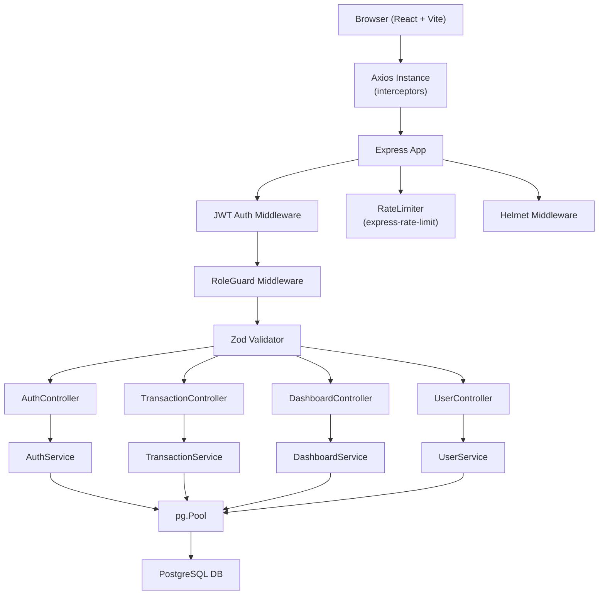

# Design Document: Finance Dashboard

## Overview

The Finance Dashboard is a full-stack web application for tracking financial transactions, viewing aggregated summaries, and managing users across three permission levels. The system consists of a Node.js/Express REST API backed by PostgreSQL, and a React single-page application built with Vite and Tailwind CSS.

The backend exposes a versioned REST API under `/api/*` with JWT-based authentication, Zod validation, role-based access control, and rate limiting. The frontend consumes this API via an Axios instance with request/response interceptors, rendering interactive charts (Recharts) and role-gated UI components.

### Key Design Decisions

- **No ORM**: Raw SQL via `pg.Pool` keeps the schema transparent and avoids abstraction overhead. Parameterized queries prevent SQL injection.
- **Soft deletes**: Transactions are never physically removed; `deleted_at` timestamps allow audit trails and safe recovery.
- **JWT stateless auth**: Tokens are signed with `jsonwebtoken` and verified on every protected request. No server-side session store is needed.
- **Zod validation**: All incoming request bodies and query parameters are validated before reaching controller logic, producing consistent 400 error shapes.
- **Role middleware**: A single `RoleGuard` factory function accepts an array of permitted roles and returns an Express middleware, keeping route definitions declarative.

---

## Architecture



### Request Lifecycle

1. Request arrives at Express
2. `helmet` sets secure headers; `cors` applies origin policy
3. `RateLimiter` checks IP request count (100 req / 15 min)
4. Route matched; JWT Auth Middleware verifies `Authorization: Bearer <token>`
5. `RoleGuard` checks decoded role against permitted roles for the route
6. Zod schema validates body / query params
7. Controller delegates to Service layer
8. Service executes parameterized SQL via `pg.Pool`
9. Response returned as JSON

---

## Components and Interfaces

### Backend

#### AuthService

```typescript
interface AuthService {
  login(email: string, password: string): Promise<{ token: string; user: PublicUser }>
  hashPassword(plain: string): Promise<string>
  verifyToken(token: string): JwtPayload
}
```

- Uses `bcryptjs` for password hashing (salt rounds: 10)
- Signs JWT with `jsonwebtoken` using `JWT_SECRET` env var; token payload: `{ id, email, role }`
- Never returns `password` field in responses

#### TransactionService

```typescript
interface TransactionService {
  create(userId: string, data: CreateTransactionDto): Promise<Transaction>
  findAll(filters: TransactionFilters): Promise<PaginatedResult<Transaction>>
  update(id: string, data: UpdateTransactionDto): Promise<Transaction>
  softDelete(id: string): Promise<void>
}

interface TransactionFilters {
  startDate?: string
  endDate?: string
  type?: 'income' | 'expense'
  category?: string
  page?: number
  limit?: number
}

interface PaginatedResult<T> {
  data: T[]
  total: number
  page: number
  limit: number
}
```

#### DashboardService

```typescript
interface DashboardService {
  getSummary(): Promise<DashboardSummary>
  getCategories(): Promise<CategoryTotal[]>
  getTrends(): Promise<MonthlyTrend[]>
  getRecent(): Promise<Transaction[]>
}

interface DashboardSummary {
  totalIncome: number
  totalExpenses: number
  netBalance: number
  transactionCount: number
}

interface CategoryTotal {
  category: string
  total: number
}

interface MonthlyTrend {
  month: string   // 'YYYY-MM'
  income: number
  expenses: number
}
```

#### UserService

```typescript
interface UserService {
  findAll(): Promise<PublicUser[]>
  updateRole(id: string, role: Role): Promise<PublicUser>
  updateStatus(id: string, status: 'active' | 'inactive'): Promise<PublicUser>
}
```

#### Middleware

```typescript
// JWT Auth Middleware
function authenticate(req: Request, res: Response, next: NextFunction): void

// RoleGuard factory
function requireRoles(...roles: Role[]): RequestHandler

// Zod validation factory
function validate(schema: ZodSchema): RequestHandler
```

#### Route Map

| Method | Path | Auth | Roles | Description |
|--------|------|------|-------|-------------|
| POST | `/api/auth/login` | No | — | Login |
| GET | `/api/transactions` | Yes | admin, analyst, viewer | List transactions |
| POST | `/api/transactions` | Yes | admin, analyst | Create transaction |
| PUT | `/api/transactions/:id` | Yes | admin, analyst | Update transaction |
| DELETE | `/api/transactions/:id` | Yes | admin, analyst | Soft-delete transaction |
| GET | `/api/dashboard/summary` | Yes | admin, analyst, viewer | Summary stats |
| GET | `/api/dashboard/categories` | Yes | admin, analyst, viewer | Category totals |
| GET | `/api/dashboard/trends` | Yes | admin, analyst, viewer | Monthly trends |
| GET | `/api/dashboard/recent` | Yes | admin, analyst, viewer | Recent transactions |
| GET | `/api/users` | Yes | admin | List users |
| PUT | `/api/users/:id/role` | Yes | admin | Update user role |
| PUT | `/api/users/:id/status` | Yes | admin | Update user status |

### Frontend

#### Component Tree

```
App
├── AuthContext (Provider)
├── Router
│   ├── ProtectedRoute
│   │   ├── Layout (nav + sidebar)
│   │   │   ├── DashboardPage
│   │   │   │   ├── StatCard (×4)
│   │   │   │   ├── AreaChart (Recharts)
│   │   │   │   └── PieChart (Recharts)
│   │   │   ├── TransactionsPage
│   │   │   │   ├── FilterBar
│   │   │   │   ├── TransactionTable
│   │   │   │   ├── Pagination
│   │   │   │   └── TransactionModal (add/edit)
│   │   │   └── UsersPage (admin only)
│   │   │       └── UserTable
│   └── LoginPage
```

#### AuthContext Interface

```typescript
interface AuthContextValue {
  user: PublicUser | null
  token: string | null
  login(email: string, password: string): Promise<void>
  logout(): void
}
```

- Persists `{ token, user }` to `localStorage` under key `finance_session`
- Restores session from `localStorage` on mount
- Clears session and redirects to `/login` on 401

#### Axios Instance

```typescript
// src/api/axios.ts
const api = axios.create({ baseURL: import.meta.env.VITE_API_URL })

// Request interceptor: attach Bearer token
api.interceptors.request.use(config => {
  const session = localStorage.getItem('finance_session')
  if (session) {
    const { token } = JSON.parse(session)
    config.headers.Authorization = `Bearer ${token}`
  }
  return config
})

// Response interceptor: handle 401
api.interceptors.response.use(
  res => res,
  err => {
    if (err.response?.status === 401) {
      localStorage.removeItem('finance_session')
      window.location.href = '/login'
    }
    return Promise.reject(err)
  }
)
```

---

## Data Models

### PostgreSQL Schema

```sql
-- users table
CREATE TABLE IF NOT EXISTS users (
  id          UUID        PRIMARY KEY DEFAULT gen_random_uuid(),
  name        TEXT        NOT NULL,
  email       TEXT        UNIQUE NOT NULL,
  password    TEXT        NOT NULL,
  role        TEXT        NOT NULL CHECK (role IN ('admin', 'analyst', 'viewer')),
  status      TEXT        NOT NULL DEFAULT 'active' CHECK (status IN ('active', 'inactive')),
  created_at  TIMESTAMPTZ NOT NULL DEFAULT NOW(),
  updated_at  TIMESTAMPTZ NOT NULL DEFAULT NOW()
);

-- transactions table
CREATE TABLE IF NOT EXISTS transactions (
  id          UUID        PRIMARY KEY DEFAULT gen_random_uuid(),
  user_id     UUID        NOT NULL REFERENCES users(id),
  amount      NUMERIC     NOT NULL,
  type        TEXT        NOT NULL CHECK (type IN ('income', 'expense')),
  category    TEXT        NOT NULL,
  date        DATE        NOT NULL,
  notes       TEXT,
  deleted_at  TIMESTAMPTZ,
  created_at  TIMESTAMPTZ NOT NULL DEFAULT NOW(),
  updated_at  TIMESTAMPTZ NOT NULL DEFAULT NOW()
);
```

### TypeScript Types

```typescript
type Role = 'admin' | 'analyst' | 'viewer'

interface User {
  id: string
  name: string
  email: string
  password: string   // never returned in API responses
  role: Role
  status: 'active' | 'inactive'
  created_at: string
  updated_at: string
}

type PublicUser = Omit<User, 'password'>

interface Transaction {
  id: string
  user_id: string
  amount: number
  type: 'income' | 'expense'
  category: string
  date: string       // ISO date string
  notes?: string
  deleted_at?: string | null
  created_at: string
  updated_at: string
}

interface JwtPayload {
  id: string
  email: string
  role: Role
}
```

### Zod Validation Schemas

```typescript
// Login
const loginSchema = z.object({
  email: z.string().email(),
  password: z.string().min(1),
})

// Create/Update Transaction
const transactionSchema = z.object({
  amount: z.number().positive(),
  type: z.enum(['income', 'expense']),
  category: z.string().min(1),
  date: z.string().regex(/^\d{4}-\d{2}-\d{2}$/),
  notes: z.string().optional(),
})

// Transaction list query
const transactionQuerySchema = z.object({
  startDate: z.string().optional(),
  endDate: z.string().optional(),
  type: z.enum(['income', 'expense']).optional(),
  category: z.string().optional(),
  page: z.coerce.number().int().positive().optional().default(1),
  limit: z.coerce.number().int().positive().optional().default(10),
})

// User role update
const updateRoleSchema = z.object({
  role: z.enum(['admin', 'analyst', 'viewer']),
})

// User status update
const updateStatusSchema = z.object({
  status: z.enum(['active', 'inactive']),
})
```

---

## Correctness Properties

*A property is a characteristic or behavior that should hold true across all valid executions of a system — essentially, a formal statement about what the system should do. Properties serve as the bridge between human-readable specifications and machine-verifiable correctness guarantees.*

### Property 1: Login response contains required fields

*For any* valid user credentials, a successful login response SHALL contain a signed JWT token and the user's id, name, email, and role fields — and SHALL NOT contain the password field.

**Validates: Requirements 1.1, 1.6**

---

### Property 2: Invalid credentials always yield 401

*For any* login attempt using an email that does not exist in the system, or using an incorrect password for an existing user, the AuthService SHALL return HTTP 401.

**Validates: Requirements 1.2, 1.3**

---

### Property 3: Password storage is always hashed

*For any* plaintext password stored in the DB, the stored value SHALL NOT equal the plaintext, and `bcrypt.compare(plaintext, stored)` SHALL return true.

**Validates: Requirements 1.5**

---

### Property 4: Inactive users are always rejected with 403

*For any* user whose status is `inactive`, a login attempt SHALL return HTTP 403 regardless of whether the password is correct.

**Validates: Requirements 1.7**

---

### Property 5: Unauthenticated requests to protected routes always yield 401

*For any* protected route, a request made without an `Authorization` header, or with an expired or invalid JWT token, SHALL return HTTP 401.

**Validates: Requirements 2.1, 2.2**

---

### Property 6: Role guard enforces permissions universally

*For any* authenticated user, a request to an endpoint that requires a role the user does not hold SHALL return HTTP 403; a request to an endpoint within the user's permitted roles SHALL not be rejected by the role guard.

**Validates: Requirements 3.1, 3.2, 7.5**

---

### Property 7: Transaction creation round-trip

*For any* valid transaction payload (amount, type, category, date, optional notes), POSTing to `/api/transactions` SHALL return HTTP 201 with a Transaction object whose fields match the submitted values.

**Validates: Requirements 4.1**

---

### Property 8: Soft-deleted transactions are invisible

*For any* transaction that has been soft-deleted, it SHALL NOT appear in any listing query (`GET /api/transactions`), any dashboard endpoint, or any recent-transactions result.

**Validates: Requirements 4.5, 4.7, 6.1, 6.2, 6.3, 6.4**

---

### Property 9: Transaction update round-trip

*For any* existing transaction and any valid update payload, a PUT request SHALL return HTTP 200 with a Transaction object whose fields reflect the updated values.

**Validates: Requirements 4.3**

---

### Property 10: Pagination metadata is always present and correct

*For any* GET request to `/api/transactions`, the response SHALL contain `data`, `total`, `page`, and `limit` fields, and the length of `data` SHALL be at most `limit`.

**Validates: Requirements 5.1, 5.5**

---

### Property 11: Date range filter excludes out-of-range transactions

*For any* date range filter (`startDate`, `endDate`), all transactions in the response SHALL have a `date` that falls within the inclusive range.

**Validates: Requirements 5.2**

---

### Property 12: Type and category filters return only matching transactions

*For any* `type` filter value, all returned transactions SHALL have that type. *For any* `category` filter value, all returned transactions SHALL match that category case-insensitively.

**Validates: Requirements 5.3, 5.4**

---

### Property 13: Dashboard summary is mathematically consistent

*For any* set of non-deleted transactions, the summary endpoint SHALL return `totalIncome` equal to the sum of all income amounts, `totalExpenses` equal to the sum of all expense amounts, `netBalance` equal to `totalIncome - totalExpenses`, and `transactionCount` equal to the count of non-deleted transactions.

**Validates: Requirements 6.1**

---

### Property 14: Category totals correctly aggregate by category

*For any* set of non-deleted transactions, the categories endpoint SHALL return one entry per distinct category whose `total` equals the sum of amounts for that category.

**Validates: Requirements 6.2**

---

### Property 15: Monthly trends are chronologically ordered

*For any* set of transactions, the trends endpoint SHALL return entries ordered chronologically by month, covering the last 6 calendar months.

**Validates: Requirements 6.3**

---

### Property 16: Recent transactions are ordered and capped

*For any* set of non-deleted transactions, the recent endpoint SHALL return at most 10 transactions ordered by `date` descending.

**Validates: Requirements 6.4**

---

### Property 17: Error responses always contain a message field

*For any* request that results in an error (400, 401, 403, 404, 429, 500), the response body SHALL be a JSON object containing at minimum a `message` field, and SHALL NOT contain stack traces or raw database error messages.

**Validates: Requirements 11.1, 11.4**

---

### Property 18: Session persists across page loads (round-trip)

*For any* successful login, the JWT token and user profile SHALL be stored in `localStorage`, and on subsequent application load, the AuthContext SHALL restore the session from `localStorage` to the same state.

**Validates: Requirements 14.1, 14.2**

---

### Property 19: 401 response always clears session and redirects

*For any* API response with HTTP 401, the frontend SHALL clear the session from `localStorage` and redirect the user to the Login page.

**Validates: Requirements 14.3, 15.2**

---

### Property 20: Logout always clears session

*For any* authenticated session, calling logout SHALL remove the JWT token and user profile from `localStorage` and redirect to the Login page, leaving no session data behind.

**Validates: Requirements 14.5**

---

### Property 21: Axios always attaches Bearer token when session exists

*For any* outgoing API request when a valid session exists in `localStorage`, the request SHALL include an `Authorization: Bearer <token>` header.

**Validates: Requirements 15.1**

---

### Property 22: Role-gated UI hides unauthorized elements

*For any* user role, the frontend SHALL only render navigation links and write-action buttons (add, edit, delete) that the role is permitted to use; viewer role SHALL see no write-action buttons, and non-admin roles SHALL not see the Users page link.

**Validates: Requirements 19.1, 19.2**

---

### Property 23: Direct navigation to restricted routes redirects

*For any* role, attempting to navigate directly to a route the role cannot access SHALL redirect the user to the Dashboard page.

**Validates: Requirements 19.3**

---

## Error Handling

### Backend Error Strategy

All errors flow through a centralized Express error handler registered as the last middleware:

```typescript
// src/middleware/errorHandler.ts
function errorHandler(err: Error, req: Request, res: Response, next: NextFunction) {
  console.error(err)  // server-side logging only
  const status = (err as any).status ?? 500
  res.status(status).json({ message: err.message ?? 'Internal server error' })
  // Never expose err.stack in response
}
```

**Error shape contract**: Every error response is `{ message: string }`. Additional fields (e.g., `errors: string[]` for validation) may be included but `message` is always present.

**Error classes**:

```typescript
class AppError extends Error {
  constructor(public message: string, public status: number) {
    super(message)
  }
}
// Usage: throw new AppError('Not found', 404)
```

**Zod validation errors**: The `validate` middleware catches `ZodError` and returns:
```json
{ "message": "Validation failed", "errors": ["amount: Required", "type: Invalid enum value"] }
```

**Database errors**: Caught in service layer, wrapped in `AppError` with generic message. Raw `pg` errors are never forwarded to the client.

### Frontend Error Strategy

- Axios response interceptor handles 401 globally (clear session, redirect)
- Page-level components catch API errors and display user-readable messages via local state
- Loading states are tracked per-request with boolean flags
- No raw error objects are rendered to the DOM

---

## Testing Strategy

### Backend

**Unit Tests** (Jest + Supertest):
- AuthService: login success, wrong password, unknown email, inactive user, password hashing
- TransactionService: create, update, soft-delete, listing with filters, pagination
- DashboardService: summary math, category aggregation, trend ordering, recent ordering
- UserService: list users (no password), role update, status update
- Middleware: JWT auth (valid, missing, expired), RoleGuard (each role combination), Zod validators (valid and invalid inputs)
- Error handler: correct status codes, no stack trace in response

**Property-Based Tests** (fast-check):
- Each correctness property (Properties 1–17) is implemented as a property-based test
- Minimum 100 iterations per property
- Tag format: `// Feature: finance-dashboard, Property N: <property_text>`
- Use in-memory mocks for `pg.Pool` to keep tests fast and deterministic

**Integration Tests**:
- Rate limiter: verify 429 after threshold (uses real HTTP)
- CORS headers: verify `Access-Control-Allow-Origin` present
- Migration: run against test DB, verify tables exist with correct schema

**Smoke Tests**:
- Helmet headers present on any response
- `.env.example` contains required variables
- Migration script runs without error on clean DB

### Frontend

**Unit Tests** (Vitest + React Testing Library):
- AuthContext: login stores session, logout clears session, session restored on mount
- ProtectedRoute: redirects unauthenticated users
- Axios interceptors: Bearer token attached, 401 clears session
- Role-gated components: viewer sees no write buttons, non-admin sees no Users link
- Dashboard page: renders 4 stat cards, shows loading indicator, shows error message

**Property-Based Tests** (fast-check):
- Properties 18–23 implemented as property-based tests with mocked API responses
- Minimum 100 iterations per property

**Visual / Snapshot Tests**:
- Stat card renders correctly with various numeric values
- Chart components render without crashing with varied data shapes

### Test Configuration

```typescript
// fast-check property test example
import fc from 'fast-check'

// Feature: finance-dashboard, Property 2: Invalid credentials always yield 401
test('invalid credentials always yield 401', async () => {
  await fc.assert(
    fc.asyncProperty(
      fc.emailAddress(),
      fc.string({ minLength: 1 }),
      async (email, password) => {
        // email guaranteed not in DB (random)
        const res = await request(app).post('/api/auth/login').send({ email, password })
        expect(res.status).toBe(401)
        expect(res.body).toHaveProperty('message')
      }
    ),
    { numRuns: 100 }
  )
})
```

### Coverage Targets

- Backend services and middleware: ≥ 90% line coverage
- Frontend components: ≥ 80% line coverage
- All 23 correctness properties must have corresponding property-based tests
