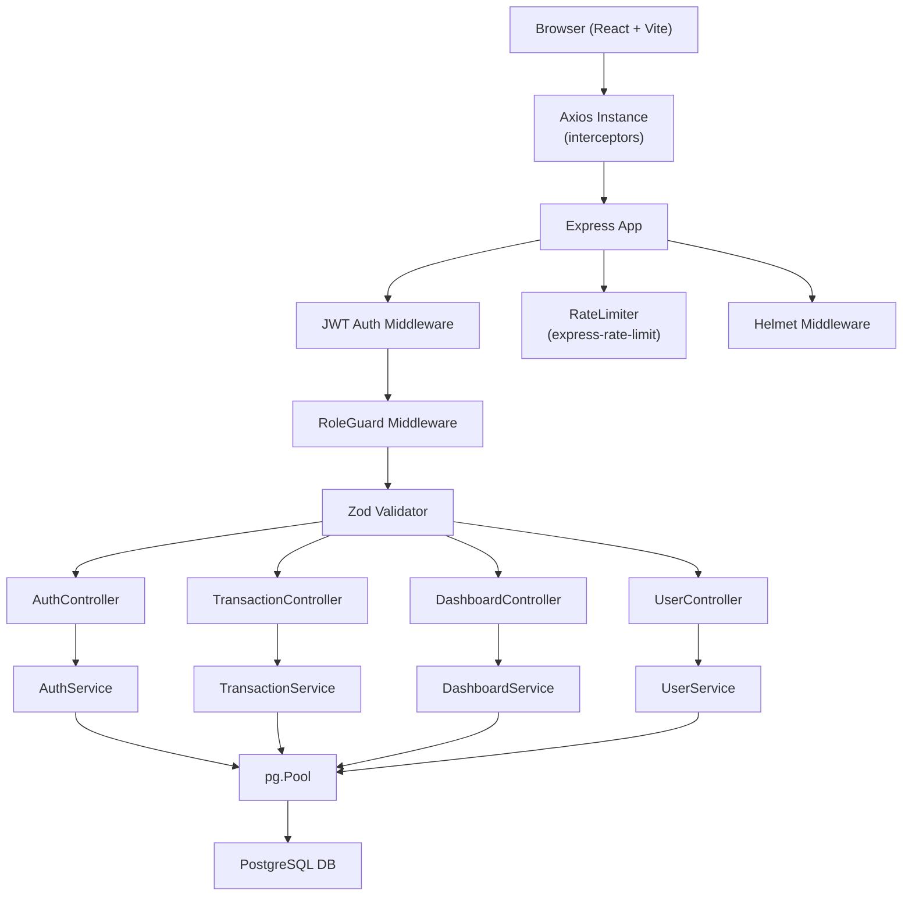

# Finance Dashboard

A full-stack financial management application with role-based access control, interactive charts, and a polished dark UI.

## Technology Stack

- **Backend**: Node.js, Express, PostgreSQL
- **Frontend**: React, Vite, Tailwind CSS, Recharts
- **Authentication**: JWT (Stateless)
- **Validation**: Zod
- **Testing**: Jest, Supertest, Fast-check

## Architecture

## API Endpoints

| Method | Path | Auth | Roles | Description |
|--------|------|------|-------|-------------|
| POST | `/api/auth/login` | No | — | Login and get JWT |
| GET | `/api/transactions` | Yes | admin, analyst, viewer | List transactions (paginated) |
| POST | `/api/transactions` | Yes | admin, analyst | Create new transaction |
| PUT | `/api/transactions/:id` | Yes | admin, analyst | Update existing transaction |
| DELETE | `/api/transactions/:id` | Yes | admin, analyst | Soft-delete transaction |
| GET | `/api/dashboard/summary` | Yes | admin, analyst, viewer | Summary statistics |
| GET | `/api/dashboard/categories` | Yes | admin, analyst, viewer | Category-wise totals |
| GET | `/api/dashboard/trends` | Yes | admin, analyst, viewer | Monthly income/expense trends |
| GET | `/api/dashboard/recent` | Yes | admin, analyst, viewer | 10 most recent transactions |
| GET | `/api/users` | Yes | admin | List all users |
| PUT | `/api/users/:id/role` | Yes | admin | Update user role |
| PUT | `/api/users/:id/status` | Yes | admin | Update user account status |

## Role Permissions

| Role | Dashboard | Transactions (Read) | Transactions (Write) | User Management |
|------|-----------|---------------------|----------------------|-----------------|
| Admin | ✅ | ✅ | ✅ | ✅ |
| Analyst | ✅ | ✅ | ✅ | ❌ |
| Viewer | ✅ | ✅ | ❌ | ❌ |

## Setup Instructions

### Prerequisites
- Node.js (v18+)
- PostgreSQL

### Backend Setup
1. `cd backend`
2. `npm install`
3. Create `.env` from `.env.example` and update `DATABASE_URL`
4. `npm run migrate` (Run migrations)
5. `npm run seed` (Load demo data)
6. `npm run dev` (Start development server)

### Frontend Setup
1. `cd frontend`
2. `npm install`
3. `npm run dev` (Start Vite dev server)

## Demo Credentials

| Email | Password | Role |
|-------|----------|------|
| `admin@finance.dev` | `Admin@123` | Admin |
| `analyst@finance.dev` | `Analyst@123` | Analyst |
| `viewer@finance.dev` | `Viewer@123` | Viewer |

## Assumptions & Tradeoffs

- **No ORM**: Raw SQL was used for transparency and to avoid abstraction overhead.
- **Soft Deletes**: Transactions use `deleted_at` to preserve history while keeping them "removed" from the UI.
- **JWT Storage**: Tokens are stored in `localStorage` for simplicity in this MVP, though HttpOnly cookies would be more secure for production.
- **Stateless Auth**: No server-side session store is required, making the API easier to scale.
